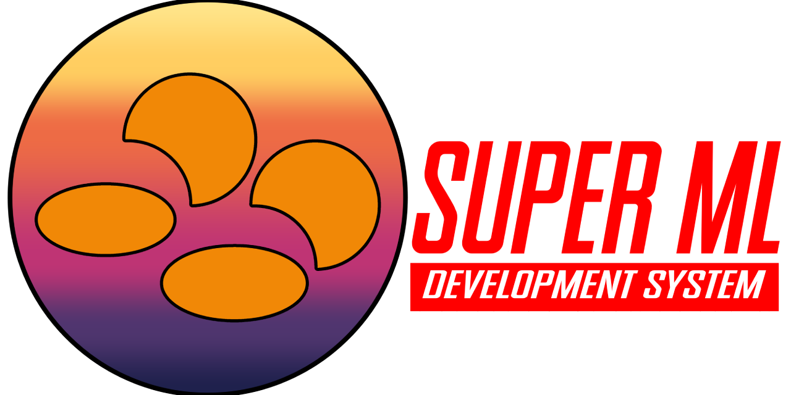

# SuperML



An interpreter and text editor for a subset of the [Caml Programming Language](https://en.wikipedia.org/wiki/Caml) for the Nintendo 3DS.

Great thanks to [Notepad3DS](https://github.com/MaeveMcT/Notepad3DS) as a jumping-off point for the text editor segment of this project.

## Progress

So far, we have:

- Rudimentary builtin functions for IO
- Rudimentary text editing
- A WIP parser using Flex/Bison
- Execution (crash-prone on real hardware)

## Compiling

### Setup

```bash
# Install dependencies
sudo apt install -y flex bison

# Install devkitARM (see below)

# Clone
git clone https://github.com/CharlesAverill/SuperML.git

# Install bannertool
git clone https://github.com/carstene1ns/3ds-bannertool.git --depth=1 && cd 3ds-bannertool
cmake -B build && cmake --build build && sudo cmake --install build
cd ..

# Install makerom
git clone https://github.com/3DSGuy/Project_CTR.git --depth=1
make -C Project_CTR/makerom deps -j
make -C Project_CTR/makerom program -j
sudo cp Project_CTR/makerom/bin/makerom /usr/bin

# Build SuperML
cd SuperML
make
```

### Unix
You will need [devkitArm] which can be obtained with

```bash
wget http://sourceforge.net/projects/devkitpro/files/Automated%20Installer/devkitARMupdate.pl
chmod +x devkitARMupdate.pl
sudo ./devkitARMupdate.pl /opt/devkitPro
echo "export DEVKITPRO=/opt/devkitPro" >> ~/.bashrc
echo "export DEVKITARM=\$DEVKITPRO/devkitARM" >> ~/.bashrc
echo "export PATH=\$PATH:\$DEVKITARM/bin" >> ~/.bashrc
source ~/.bashrc
```

Please note: The env variables need to be available from sudo

```bash
Defaults env_keep += "DEVKITPRO DEVKITARM"
```

| Make Commands    | Action                                                                                    |
| -----------------| ----------------------------------------------------------------------------------------- |
| make             | 
| make 3ds         | The 3ds target will build a `<project name>.3ds` file.
| make 3dsx        | The 3dsx target will build both a `<project name>.3dsx` and a `<project name>.smdh` files.
| make cia         | The cia target will build a `<project name>.cia` file.
| make azahar      | The azahar target will build a `<project name>.3dsx` file and automatically run azahar.
| make elf         | The elf target will build a `<project name>.elf` file.
| make fbi         | The fbi target will build a `<project name>.cia` file and send it to your 3ds via [FBI].
| make hblauncher  | The hblauncher target will build a `<project name>.3dsx` file and send your 3ds via homebrew launcher.<sup>2</sup>
| make release     | The release target will build `.elf`, `.3dsx`, `.cia`, `.3ds` files and a zip file (.3dsx and .smdh only).<sup>3</sup>

**Notes:** 
* <sup>2</sup> If you intend to use the hblauncher and fbi targets ensure you have set IP3DS in the `Makefile` to the ip address of your 3ds on your network.
    * In homebrew launcher press Y and you can netload your 3dsx file.
    * In [FBI] go to remote install and select `Receive URLs over the network`.
* <sup>3</sup> This requires having [makerom] and [bannertool] both included in `buildtools` as 7z files.
* If you are on windows you will need both of the following in your `$PATH` (included aswell)
    * [zip] 
    * [libbz2.dll]

### Windows
Install the following using [devkitProUpdater]:
* [devkitArm]
* [libctru]
* [citro3D]

**Note**: It is suggested to install dev tools at the root of your disk drive i.e. `C:\Development\3ds-homebrew\devkitPro`

Once installed, make sure you have access to a C compiler from `cmd`. If you're not sure install [mingw-w64] to 
`C:\Development\mingw-w64` and then add the path `C:\Development\mingw-w64\mingw32\bin` to your env variables.

Open command prompt as an **administrator** and `cd` into the devkitPro installation folder. Some commands need admin 
rights to properly install. Additionally make sure your antivirus software does not interfere. 

Next `git clone` the latest [3ds_portlibs]:

```bash
git clone https://github.com/devkitPro/3ds_portlibs.git
cd 3ds_portlibs

make zlib
make install-zlib
```

Finally, clone this repo and build with one of the commands found in usage.

## Credits
All of this would not have been possible without the work of
* [Smealum](https://github.com/smealum)
* [Steveice10](https://github.com/Steveice10)
* and countless others


[//]: # (These are reference links used in the body of this note and get stripped out when the markdown processor does its job. There is no need to format nicely because it shouldn't be seen. Thanks SO - http://stackoverflow.com/questions/4823468/store-comments-in-markdown-syntax)

[3ds_portlibs]: <https://github.com/devkitPro/3ds_portlibs>
[devkitProUpdater]: <https://sourceforge.net/projects/devkitpro/>
[devkitArm]: <https://sourceforge.net/projects/devkitpro/files/devkitARM/>
[citro3D]: <https://sourceforge.net/projects/devkitpro/files/citro3d/>
[libctru]: <https://sourceforge.net/projects/devkitpro/files/libctru/>
[mingw-w64]: <https://sourceforge.net/projects/mingw-w64/>
[FBI]: <https://github.com/Steveice10/FBI>
[CLion]: <https://www.jetbrains.com/clion/>
[mingw-w64]: <https://sourceforge.net/projects/mingw-w64/>
[bannertool]: <https://github.com/Steveice10/bannertool>
[makerom]: <https://github.com/profi200/Project_CTR>
[zip]: <http://downloads.sourceforge.net/gnuwin32/zip-3.0-bin.zip>
[libbz2.dll]: <http://downloads.sourceforge.net/gnuwin32/zip-3.0-dep.zip>
